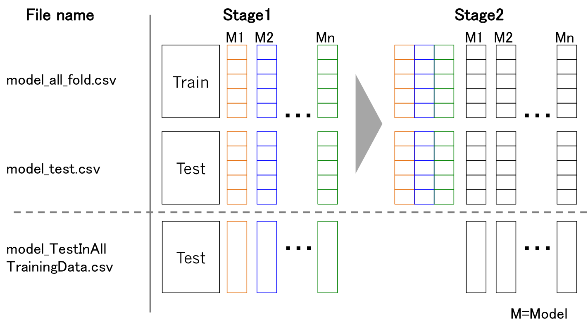

Stacking (stacked generalization)
====

[](https://badge.fury.io/py/stacking)
[](https://github.com/ikki407/stacking/LICENSE)

## Overview

[ikki407/stacking](https://github.com/ikki407/stacking) - Simple and useful stacking library, written in Python.

User can use models of scikit-learn, XGboost, and Keras for stacking.  
As a feature of this library, **all out-of-fold predictions** can be saved for further analisys after training.

## Description

[Stacking](https://en.wikipedia.org/wiki/Ensemble_learning#Stacking) (sometimes called stacked generalization) involves training a learning algorithm to combine the predictions of several other learning algorithms. The basic idea is to use a pool of base classifiers, then using another classifier to combine their predictions, with the aim of reducing the generalization error. 

[This blog](http://mlwave.com/kaggle-ensembling-guide/) is very helpful to understand stacking and ensemble learning.


## Usage

**See working example:**
 
 * [binary classification](https://github.com/ikki407/stacking/tree/master/examples/binary_class)
 * [multi-class classification](https://github.com/ikki407/stacking/tree/master/examples/multi_class)
 * [regression](https://github.com/ikki407/stacking/tree/master/examples/regression)

To run these examples, just run `sh run.sh`. Note that: 

1. Set train and test dataset under data/input

2. Created features from original dataset need to be under data/output/features

3. Models for stacking are defined in `scripts.py` under scripts folder

4. Need to define created features in that scripts

5. Just run `sh run.sh` (`python scripts/XXX.py`).


### Detailed Usage

1. Set train dataset with its target data and test dataset.

    ```python
    FEATURE_LIST_stage1 = {
                    'train':(
                             INPUT_PATH + 'train.csv',
                             FEATURES_PATH + 'train_log.csv',
                            ),
    
                    'target':(
                             INPUT_PATH + 'target.csv',
                            ),
    
                    'test':(
                             INPUT_PATH + 'test.csv',
                             FEATURES_PATH + 'test_log.csv',
                            ),
                    }
    ```

2. Define model classes that inherit `BaseModel` class, which are used in Stage 1, Stage 2, ..., Stage N.

    ```python
    # For Stage 1
    PARAMS_V1 = {
            'colsample_bytree':0.80,
            'learning_rate':0.1,"eval_metric":"auc",
            'max_depth':5, 'min_child_weight':1,
            'nthread':4,
            'objective':'binary:logistic','seed':407,
            'silent':1, 'subsample':0.60,
            }
    
    class ModelV1(BaseModel):
            def build_model(self):
                return XGBClassifier(params=self.params, num_round=10)
    
    ...
    
    # For Stage 2
    PARAMS_V1_stage2 = {
                        'penalty':'l2',
                        'tol':0.0001, 
                        'C':1.0, 
                        'random_state':None, 
                        'verbose':0, 
                        'n_jobs':8
                        }
    
    class ModelV1_stage2(BaseModel):
            def build_model(self):
                return LR(**self.params)
    ```
    
3. Train each models of Stage 1 for stacking.

    ```python
    m = ModelV1(name="v1_stage1",
                flist=FEATURE_LIST_stage1,
                params = PARAMS_V1,
                kind = 'st'
                )
    m.run()
    
    ...
    ```

4. Train each model(s) of Stage 2 by using the prediction of Stage-1 models.

    ```python
    FEATURE_LIST_stage2 = {
                'train': (
                         TEMP_PATH + 'v1_stage1_all_fold.csv',
                         TEMP_PATH + 'v2_stage1_all_fold.csv',
                         TEMP_PATH + 'v3_stage1_all_fold.csv',
                         TEMP_PATH + 'v4_stage1_all_fold.csv',
                         ...
                         ),
    
                'target':(
                         INPUT_PATH + 'target.csv',
                         ),
    
                'test': (
                        TEMP_PATH + 'v1_stage1_test.csv',
                        TEMP_PATH + 'v2_stage1_test.csv',
                        TEMP_PATH + 'v3_stage1_test.csv',
                        TEMP_PATH + 'v4_stage1_test.csv',
                        ...                     
                        ),
                }
    
    # Models
    m = ModelV1_stage2(name="v1_stage2",
                    flist=FEATURE_LIST_stage2,
                    params = PARAMS_V1_stage2,
                    kind = 'st',
                    )
    m.run()
    ```

5. Final result is saved as `v1_stage2_TestInAllTrainingData.csv`.

## Installation
To install stacking, `cd` to the stacking folder and run the install command**(up-to-date version, recommended)**:
```
sudo python setup.py install
```

You can also install stacking from PyPI:
```
pip install stacking
```


## Files

- [stacking/base.py](https://github.com/ikki407/stacking/blob/master/stacking/base.py) : stacking module
- examples/
 - [binary_class](https://github.com/ikki407/stacking/tree/master/examples/binary_class) : binary classification
 - [multi_class](https://github.com/ikki407/stacking/tree/master/examples/multi_class) : multi-class classification
 - [regression](https://github.com/ikki407/stacking/tree/master/examples/regression) : regression


## Details of scripts

- base.py: 
  - Base models for stacking are defined here (using sklearn.base.BaseEstimator).
  - Some models are defined here. e.g., XGBoost, Keras, Vowpal Wabbit.
  - These models are wrapped as scikit-learn like (using sklearn.base.ClassifierMixin, sklearn.base.RegressorMixin).
  - That is, model class has some methods, fit(), predict_proba(), and predict().

New user-defined models can be added here.

Scikit-learn models can be used.

Base model have some arguments.

- 's': Stacking. Saving oof(out-of-fold) prediction(`{model_name}_all_fold.csv`) and average of test prediction based on train-fold models(`{model_name}_test.csv`). These files will be used for next level stacking.

- 't': Training with all data and predict test(`{model_name}_TestInAllTrainingData.csv`). In this training, no validation data are used.

- 'st': Stacking and then training with all data and predict test ('s' and 't').

- 'cv': Only cross validation without saving the prediction.


Define several models and its parameters used for stacking.
Define task details on the top of script.
Train and test feature set are defined here. 
Need to define CV-fold index.

Any level stacking can be defined.



## Reference

[1] [Wolpert, David H. Stacked generalization, Neural Networks, 5(2), 241-259](http://machine-learning.martinsewell.com/ensembles/stacking/Wolpert1992.pdf)

[2] [Ensemble learning(Stacking)](https://en.wikipedia.org/wiki/Ensemble_learning#Stacking)

[3] [KAGGLE ENSEMBLING GUIDE](http://mlwave.com/kaggle-ensembling-guide/)

